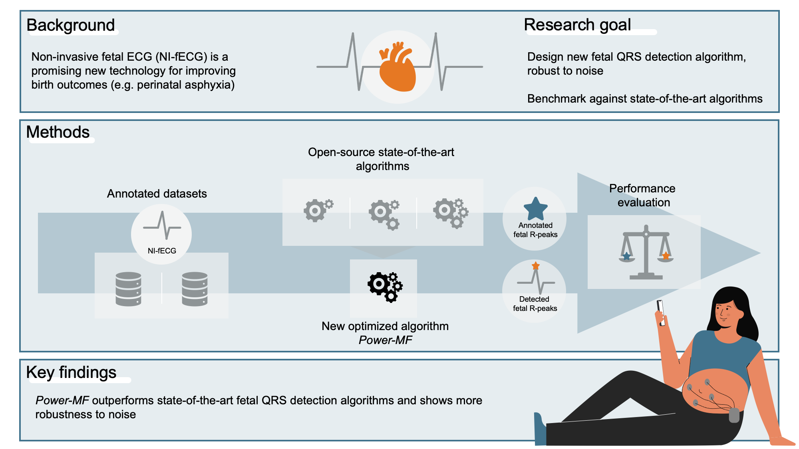

# Fetal ECG Benchmarking
## Robust Fetal QRS Extraction from Non-invasive  Electrocardiogram Recordings


The emerging technology of non-invasive fetal electrocardiography shows promise as a new sensing technology for fetal cardiac activity, offering potential advancements in the detection and management of perinatal asphyxia. Although algorithms for fetal QRS detection have been developed in the past, only a few of them demonstrate accurate performance in the presence of noise and artifacts. We propose Power-MF, a new algorithm for fetal QRS detection combining power spectral density and matched filter techniques. This repository presents a benchmark of Power-MF against against three open-source algorithms on two recently published datasets (Abdominal and Direct Fetal ECG Database: ADFECG, subsets B1 Pregnancy and B2 Labour; Non-invasive Multimodal Foetal ECG-Doppler Dataset for Antenatal Cardiology Research: NInFEA). 

Link to publication: xxx



The algorithm benchmarking comprises the following algorithms:
* Power-MF (this work)
* Behar ([Publication](https://iopscience.iop.org/article/10.1088/0967-3334/35/8/1569), [Code](https://archive.physionet.org/challenge/2013/sources))
* Sulas ([Publication](https://www.nature.com/articles/s41597-021-00811-3), [Code](https://github.com/rsameni/NInFEADataset))
* Varanini ([Publication](https://iopscience.iop.org/article/10.1088/0967-3334/35/8/1607), [Code](https://archive.physionet.org/challenge/2013/sources))

## Results
This is an overview of the algorithm benchmarking results. The complete evaluation can be found in the corresponding publication: xxx

### NInFEA Dataset


### ADFECG Dataset


## Project Structure
```
fecg-benchmarking
│   README.md
├── Code    # The core library folder. All project-wide helper and algorithms go here
│   ├── benchmark_algorithms.m  # Main script for algorithm benchmarking
│   ├── parameter_optimization.m    # Script for optimizing Power-MF's parameter
│   ├── PowerMF.m   # Function for Power-MF algorithm
│   ├── Behar14.m   # Function for Behar14 algorithm
│   ├── Sulas21.m   # Function for Sulas21 algorithm
│   ├── Varanini14.m    # Function for Varanini14 algorithm
│   ├── subfunctions    # Subfunctions required for algorithms
│       ├── README.md
│       ├── ...
│   ├── helper # Helper functions 
│   ├── plot # Plot functions
│       ├── boxplots_adfecgdb.m # Script to create results boxplot for ADFECG dataset
│       ├── boxplots_ninfea.m   # Script t create results boxplot for NInFEA dataset
├── Data  # Datasets
│   ├── README.md
│   ├── ...
├── Results  # Contains result files
│   ├── ...
```


## Getting Started

### Installation
```
git clone https://github.com/mad-lab-fau/fecg-benchmarking.git
```

### Requirements

MATLAB version R2021a 

To use this code, the following steps are required:

1. Clone the repository 
2. Download the datasets NInFEA, ADFECG and Challenge2013 in the respective folders in `./Data/`
    - [NInFEA](https://physionet.org/content/ninfea/1.0.0/) 
    - [ADFECG](https://doi.org/10.6084/m9.figshare.c.4740794.v1) 
    - [Challenge2013](https://physionet.org/content/challenge-2013/1.0.0/)
3. Run the script xx to convert raw data files to .mat files -> TODO
4. Download the dependencies to the folder `./Code/subfunctions/`
    - [OSET](https://github.com/alphanumericslab/OSET)
    - [fecgsyn](https://github.com/fernandoandreotti/fecgsyn)
    - [Varanini14](https://archive.physionet.org/challenge/2013/sources)
    - [Behar14](https://archive.physionet.org/challenge/2013/sources)
5. Run `./Code/benchmark_algorithms.m` to generate algorithm results and store them in `./Results/`folder
6. Run `./Code/boxplots_adfecgdb.m` and `./Code/boxplots_ninfea.m` to generate boxplots from results in `./Results/`folder


